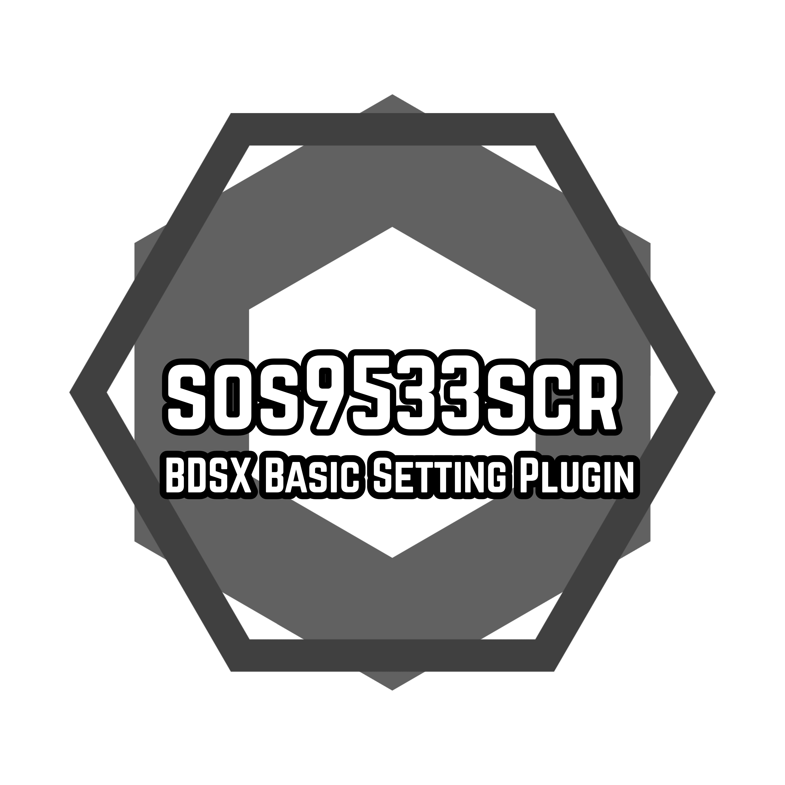

<div align="center">   

<h2>Basic Setting Plugin for BDSX. </h2>

[](https://discord.gg/mSfeVprMkv) 
[](LICENSE) <br>
[](https://github.com/sos9533/bdsx-sos9533scr/stargazers)
[](https://github.com/sos9533/bdsx-sos9533scr/graphs/contributors)<br><br>
</div>

------------------------------------------------- 

<br><br><br>
<div align="center">   

<h5>아래 버튼을 클릭하여 사용법을 확인하세요. <br>Click the button below to see how to use it.</h5>

[](#sos9533scr-english)  
[](#sos9533scr-korean)  
[](#Note)<br><br>

</div>
<br>


### 2.3.0 UPDATE [2023/12/10]
sos9533scr has been renewed to 2.0. </br>
Add back command </br>
<br><br><br><br>


-------------------------------------------------
# sos9533scr-english

Create by [`sos9533`](https://github.com/sos9533)

## Features

```
┌
├ join event
│  ├ output join log
│  ├ output join user INFO log
│  ├ output exit log
│  ├ OS tag
│  └ welcome message
│
├ chat event
│  ├ output chat log
│  ├ prefix
│     ├ /prefix (prefix) - user command
│     ├ /prefix (name) (prefix) - op command
│     └ /prefix - user command [UI]
│  └ block §
│
├ OP command
│  ├ kick command
│  ├ mute command
│  ├ ban command
│  ├ simple time set command
│  └ get INFO command
│
├ user command
│  ├ spawn command
│  ├ custom tp command (3)
│  ├ sethome command
│  ├ tpa command
│  ├ my INFO command
│  ├ basic item command
│  └ back command
│
├ anti cheat
│  ├ kick samsung toolbox user
│  ├ chatcut
│     ├ block long chat
│     ├ block fast chat
│     ├ block same chat
│     └ block long whisper
│  ├ anti crasher
│  └ kick long nickname
│
├ etc
│  ├ logging
│  ├ activity tag
│     ├ sneak detection
│     └ jump detection
│  └ bossbar command
└
```


- open source

- [ [mdisprgm/bdsx-anticrasher] ](https://github.com/mdisprgm/bdsx-anticrasher)

- [ [kdg7313/bdsx-script] ](https://github.com/kdg7313/bdsx-script)

## How_to_use

1. Unzip all files in `bdsx-master/plugins`

ex)
```
└─bdsx-master
    └─plugins
        └─bdsx-sos9533scr-main
            └─ bds
            └─ scr
                └─ anticrasher.ts
                └─ ....
            └─ .gitignore
            └─ .npmignore
            └─ index.ts
            └─ setting.ts
            └─ functions.ts
            └─ LICENSE
            └─ package.json
```

2. Refer to below and set `bdsx-master/setting.ts`

> when you choose y/n, write true/false behind  ': boolean ='

```ts
//use welcomemessage (true/false)
let usewelcomemessage: boolean = true;
```

```ts
//use welcomemessage (true/false)
let usewelcomemessage: boolean = false;
```

---

> when you write something, use " "

```ts
//welcomemessage
const welcomemessage = "§l§7welcome! this is steve's server!";
```

```ts
//welcomemessage
const welcomemessage = "§l§Hello! this is my server!";
```

---

> when write number, dont use " "

```ts
//prefix max length  (not include 'How to use' style A)
const chinlength = 20;
```

```ts
//prefix max length  (not include 'How to use' style A)
const chinlength = 10;
```

---

> when you write coordinate, use " "

```ts
//spawn coordinate (x y z)
const spawncoordinate = "0 10 0";
```

```ts
//spawn coordinate (x y z)
const spawncoordinate = "10 10 10";
```

---

> when you choose style, write style's uppercase alphabet
```ts
//output style
//style A     <prefix> <Name> : message
//style B     <prefix> Name : message
//style C     [prefix] <Name> : message
//style D     [prefix] Name : message
let chinchatset = "A";
```

```ts
//output style
//style A     <prefix> <Name> : message
//style B     <prefix> Name : message
//style C     [prefix] <Name> : message
//style D     [prefix] Name : message
let chinchatset = "D";
```


-----------------------------------------------------------------------------


# sos9533scr-korean

본 플러그인은 [`sos9533`](https://omlet.gg/profile/sos9533)을 포함한 유저들이 제작한 BDSX 기본세팅 플러그인입니다. 

## 기능

```
┌
├ 참가/퇴장 이벤트
│  ├ 참가 로그 출력
│  ├ 참가자 정보 로그 출력
│  ├ 퇴장 로그 출력
│  ├ OS 태그
│  └ 참가자 환영 메시지
│
├ 채팅 이벤트
│  ├ 채팅 로그 출력
│  ├ 칭호
│     ├ /칭호 (칭호) - 일반유저 명령어
│     ├ /칭호 (닉네임) (칭호) - op유저 명령어
│     └ /칭호 - 일반유저 명령어 [UI]
│  └ § 사용 제한
│
├ 관리자 명령어
│  ├ 강제퇴장 명령어
│  ├ 채팅금지 명령어
│  ├ 디바이스 시간 밴 명령어
│  ├ 닉네임 시간 밴 명령어
│  ├ 낮, 밤 간단 변경 명령어
│  └ 유저정보 확인 명령어
│
│
├ 일반유저 명령어
│  ├ 스폰 명령어
│  ├ 커스텀 tp명령어 (3개)
│  ├ 셋홈 명령어(sethome)
│  ├ 티피요청 명령어(tpa)
│  ├ 내정보 확인 명령어
│  ├ 기본템 명령어
│  └ 백 명령어
│
├ 안전한 서버관리
│  ├ 삼성 툴박스 유저 접속방지
│  ├ 도배방지
│     ├ 장문방지
│     ├ 단타방지
│     ├ 똑같거나 비슷한 채팅 방지
│     └ 귓속말 장문방지
│  ├ 크래셔 방지 (지퍼 크래셔 방지)
│  └ 참가시 긴 닉네임 강제퇴장시키기
│
├ 기타기능
│  ├ 로깅
│  ├ 활동감지 태그
│     ├ 웅크리기 감지
│     └ 점프 감지
│  └ 보스바 명령어
└
```


안티크래셔는 해당 코드를 사용하였습니다.
[ [mdisprgm/bdsx-anticrasher] ](https://github.com/mdisprgm/bdsx-anticrasher)

도배방지는 해당 코드를 사용하였습니다.
[ [kdg7313/bdsx-script] ](https://github.com/kdg7313/bdsx-script)

`( 위 오픈소스는 MIT 라이센스로써 저작권 표시 및 허가 표시를 소프트웨어의 모든 복제물 또는 중요한 부분에 기재하고 사용할수 있습니다. )`

## 사용법

1. `bdsx-master/plugins` 디렉터리에 플러그인 폴더를 두세요.
```
└─bdsx-master
    └─plugins
        └─bdsx-sos9533scr-main
            └─ bds
            └─ scr
                └─ anticrasher.ts
                └─ ....
            └─ .gitignore
            └─ .npmignore
            └─ index.ts
            └─ setting.ts
            └─ functions.ts
            └─ LICENSE
            └─ package.json
```

2. 위와같이 적용한 후 아래와 같이 `bdsx-master/plugins/bdsx-sos9533scr-main/setting.ts` 파일 안에서 const또는 let부분을 원하는대로 변경하시면 됩니다.

> 아래와 같은 사용여부를 선택할때는 : boolean = 뒤에 true또는 false를 입력합니다.
> (true=네, false=아니요)

```ts
//참여 환영 메시지 사용여부 (true/false)
let usewelcomemessage: boolean = true;
```

```ts
//참여 환영 메시지 사용여부 (true/false)
let usewelcomemessage: boolean = false;
```

---

> 아래와 같은 글자를 적는 부분에서는 ""를 사용합니다.

```ts
//참여 환영 메시지 - 참가한 플레이어의 채팅창에 출력
const welcomemessage = "§l§7환영합니다!"
```

```ts
//참여 환영 메시지 - 참가한 플레이어의 채팅창에 출력
const welcomemessage = "§l§7안녕하세요!!"
```

---

> 아래와 같은 숫자를 적는 부분에서는 ""를 입력하지 않습니다.

```ts
//긴 닉네임 길이 (권장:30)
const longnicknamekicklength = 30
```

```ts
//긴 닉네임 길이 (권장:30)
const longnicknamekicklength = 50
```

---

> 아래와 같은 좌표를 적는 부분에는 ""를 사용합니다.

```ts
//스폰 좌표 (x y z)
const spawncoordinate = "0 10 0"
```

```ts
//스폰 좌표 (x y z)
const spawncoordinate = "100 5 100"
```

---

> 아래와 같은 형식을 고를때는 해당 형식의 영어 알파벳을 대문자로 "" 안에 입력합니다..
```ts
//칭호 형식 설정
//형식A     <칭호> <닉네임> : 채팅
//형식B     <칭호> 닉네임 : 채팅
//형식C     [칭호] <닉네임> : 채팅
//형식D     [칭호] 닉네임 : 채팅
let chinchatset = "A"
```

```ts
//칭호 형식 설정
//형식A     <칭호> <닉네임> : 채팅
//형식B     <칭호> 닉네임 : 채팅
//형식C     [칭호] <닉네임> : 채팅
//형식D     [칭호] 닉네임 : 채팅
let chinchatset = "D"
```

# Note

## LICENSE

```
MIT LICENSE - Copyright (c) 2023 sos9533

Can use it freely without any restrictions.
But don't change the code that makes "/sos9533scr" visible in-game.

어떠한 제한 없이 사용할수 있음.
하지만 "/sos9533scr"가 인게임에서 보이게 하는 코드를 변경하지 말것.
```

## Contributors
- [`sos9533`](https://github.com/sos9533)
- [`mdisprgm`](https://github.com/mdisprgm)
- [`job-gut`](https://github.com/job-gut)
- [`Blue00123`](https://github.com/Blue00123)
- [`Namacksin1234`](https://github.com/Namacksin1234)


## About sos9533
- `Discord : sos9533`
